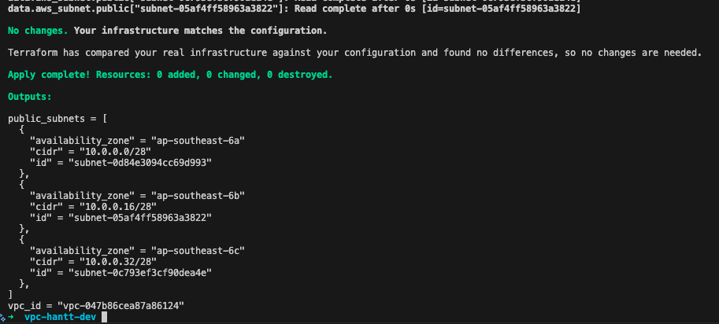
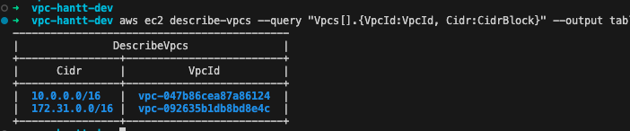
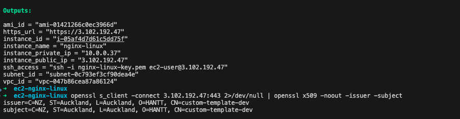
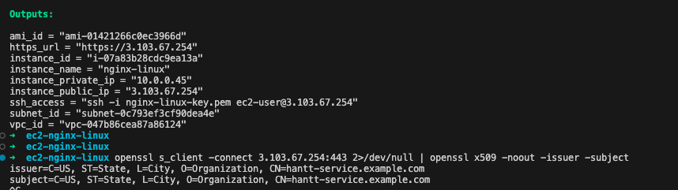
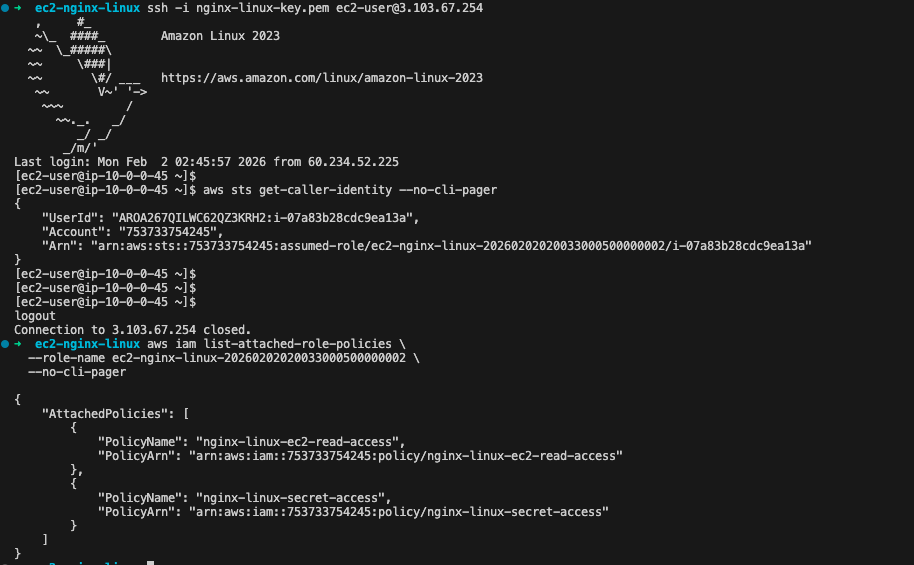
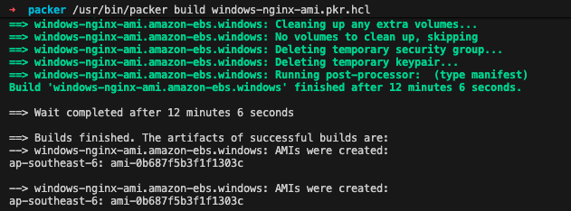

# Practical Exercise
## Using Terraform Build the following:

[X] A VPC containing reasonable subnets for deploying AWS EC2's.

[X] An EC2 within the VPC that has reasonable IAM permissions and associated resources.

## Using Ansible configure the following on the EC2.

[X] Install a nginx server on the EC2.

[X] Configure the nginx server to be able to serve its pages across HTTPS (can use self-signed certificate).

## Using Packer
[X] Use Packer to run Ansible to produce an AMI that contains the nginx with HTTPS support.

[X] Configure the same nginx on a Windows EC2.

## Deliverables

[X] The Terraform template that was used to create the AWS resources.
  - `./terraform/vpc-hannt-dev`
  - `./terraform/ec2-nginx-linux`
  - `./terraform/ec2-nginx-windows`

[X] The Ansible script that was used to configure the nginx server.
  - `./ansible/README.md`

[x] Some screen shots showing the relevant resources successfully created in
the AWS Account

VPC and Subnets created using Terraform

[x] Some screenshots of the results of HTTPS requests to the nginx server.

EC2 provisioned using the Packer-created AMI with a temporary self-signed TLS certificate used by Nginx.
 
    

EC2 provisioned using Packer-created AMI, but the cert installed from Secrets Manager using Ansible during the Terraform post-provisioning step. *(This simulates a production setup where the TLS certificate is managed outside of the AMI.)*

EC2 has only reasonable IAM permissions
 

Building Windows AMI using Packer with Ansible

Verifying Nginx on Windows EC2 with a temporary self-signed TLS certificate.

